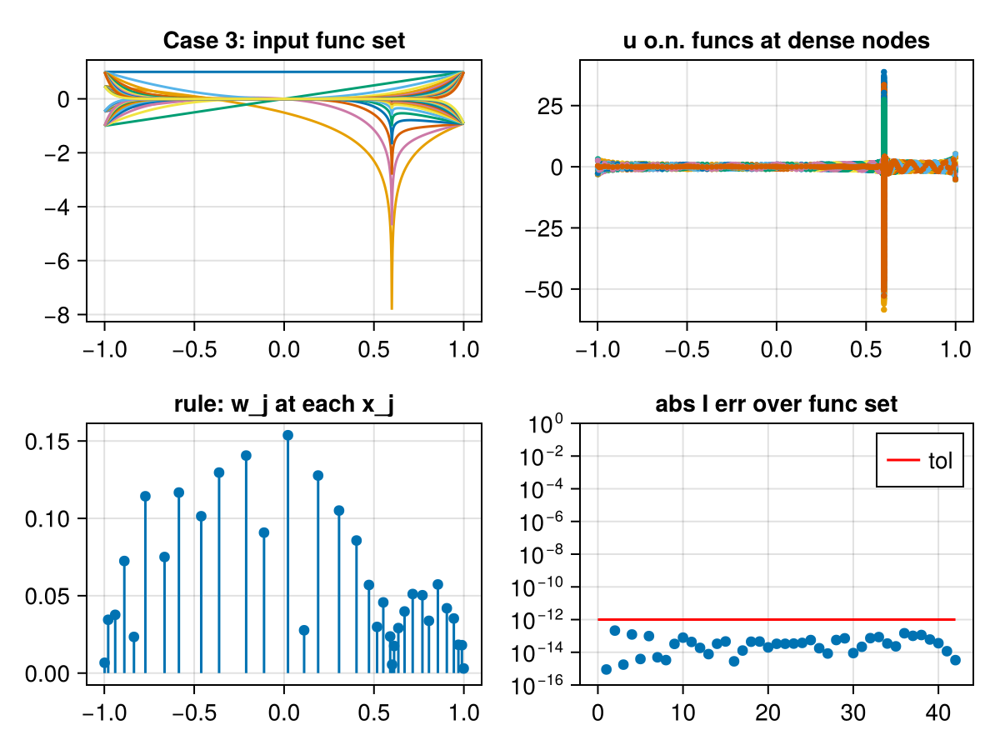

# Generalized Chebyshev Quadrature

author: Alex H. Barnett

A scratch repo for codes for GCQ. Such codes create a custom 1D quadrature scheme (nodes and weights) that integrate a given family of functions to a prescribed user tolerance $\epsilon$. The algorithm is:

 1. Use adaptive panel-wise quadrature with the user-supplied tolerance on the entire function set, giving "fine" nodes $z$ and weights $v$.
 2. Fill the matrix $A$ with each column being one function in the family evaluated on the fine nodes, multiplied by the square-root of the weights $v$. 
 3. Extract $U$ as an $\epsilon$-accurate orthonormal basis for the range of $A$. This can be done by taking the economy SVD of $A$, then stacking its $r$ left singular vectors as columns, $r$ being the $\epsilon$-rank of $A$.
 4. Find a subset of rows that span the row space of $U$, for instance doing CPQR on $U^T$ and keeping the row indices given by the pivots.
 5. The output nodes $x$ are the fine nodes with the skeleton indices.
 6. The output weights $w$ solve the usual "Vandermonde transpose" linear system for the functions in the unweighted columns of $U$ (specifically, the matrix is the transpose of the skeletonized $U$, column-weighted by the square-roots of $v$, while the right-hand side is the row sums of the square-root row-weighted transpose of the original $U$ matrix).

Examining the code is probably clearer at this point. Extended precision may be needed for Step 6 for more tricky function families, but for benign singularities working precision is enough if you don't care about full accuracy. If the size of the family is not large (<100), then the cost is usually dominated by the number of fine nodes (in which it is linear). The cost is usually less than one second on a laptop, in double precision. GCQ is the initial step in generalized Gaussian quadrature (GGQ; see first reference below), which can reduce the number of nodes by up to a factor of 2, in 1D. However, GCQ (unlike the full GGQ) is simple, fast (unless you have a family of thousands of functions) and automatic.

### Example

In Julia, our implementation is called ``genchebquad``. Here we use it to build a custom 12-digit accurate quadrature on (-1,1) for smooth functions plus functions are smooth times a logarithmic singularity at ``x0=0.6`` (inside the integration interval):

```julia-repl
    a, b = -1.0, 1.0                                                    # interval
    x0 = 0.6                                                            # location of log singularity
    # construct the rule...
    fs = x -> reduce(vcat, x^k .* [1, log(abs(x - x0))] for k = 0:20)   # family of 41 funcs
    x, w = genchebquad(fs, a, b, 1e-12)                                 # get nodes and weights
    println("num nodes = ", length(x))
    f = x -> sin(1 + 3x)                                                # smooth test func
    fp = x -> 3cos(1 + 3x)                                              # fp must be deriv of f
    println("smooth error = ", sum(w .* fp.(x)) - f(b) + f(a))
    f = x -> sin(3 * (x - x0)) * log(abs(x - x0))                       # log-singular test
    fp = x -> 3cos(3(x - x0)) * log(abs(x - x0)) + 3sinc(3(x - x0) / pi)
    println("smooth.log error = ", sum(w .* fp.(x)) - f(b) + f(a))
```

Its output is
```julia-repl
num nodes = 34
smooth error = -4.298783551348606e-13
smooth.log error = 8.89843754237063e-13
```

This is in ``julia/examples/``. Here is a picture (see ``julia/test/``) of the function family (top left), orthonormal set on the adaptive grid (top right), stick plot of nodes and weights (lower left), and errors on each member of the input family (lower right):



See the docstring in ``julia/src`` for another example.

### Directories

 - ``julia`` for Julia code
 - ``matlab`` for MATLAB/Octave code
 - ``pics`` for output figures

### References

 - Sec. 4.3 of: J. Bremer, Z. Gimbutas, and V. Rokhlin, "A nonlinear optimization procedure for generalized Gaussian quadratures," SIAM J. Sci. Comput. 32(4), 1761--1788 (2010).
 - App. B of: D. Malhotra and A. H. Barnett, "Efficient convergent boundary integral methods for slender bodies," J. Comput. Phys. 503, 112855 (2024).

### Acknowledgments

The author is grateful to Dhairya Malhotra for teaching him GCQ, and to Steven G. Johnson for adding segment and count outputs to ``QuadJK.jl``.

